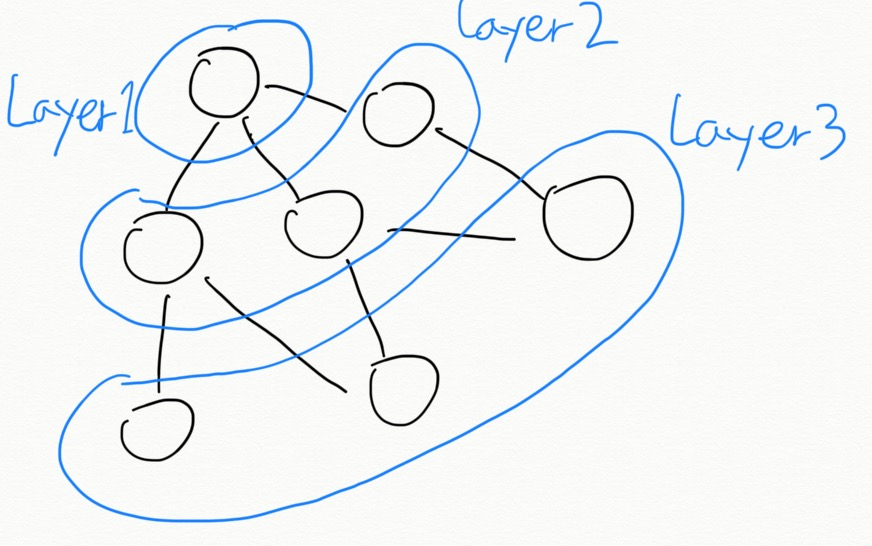
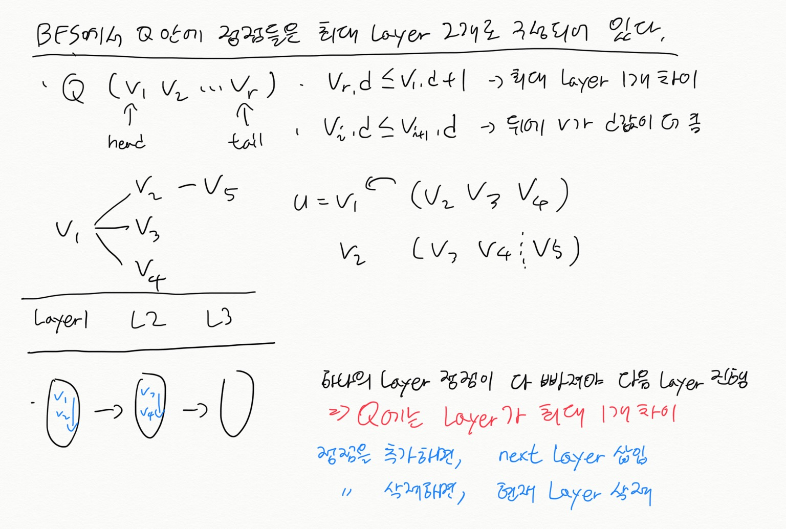
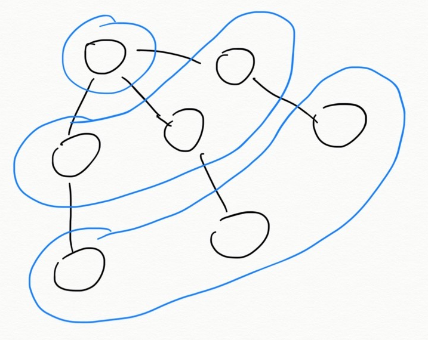

# BFS (Breadth-First Serch)
  
## 너비 우선 탐색 기본 개념

그래프 정점을 방문 할 때, Layer 단위로 방문하여 Search.  

## 정점 구분

정점을 coloring 하여 구분한다.  
White | Gray | Black | 
------|------|-------|-
방문전 | 경계선 | 방문후  
  
## 사용
최단 경로 찾기에 주로 BFS 사용한다.  
최단 경로는 다양하게 응용이 될 수 있다.  
단순히 최단 거리가 아니라 그래프를 만들어서 최소라든지... 등  
  
## 특징
1. BFS에서 Queue안에 있는 정점(Gray)는 최대 Layer가 1개 차이 난다.

증명

  

## BFS 스패닝 트리

