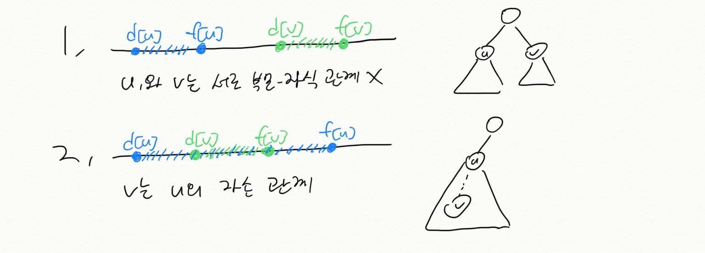
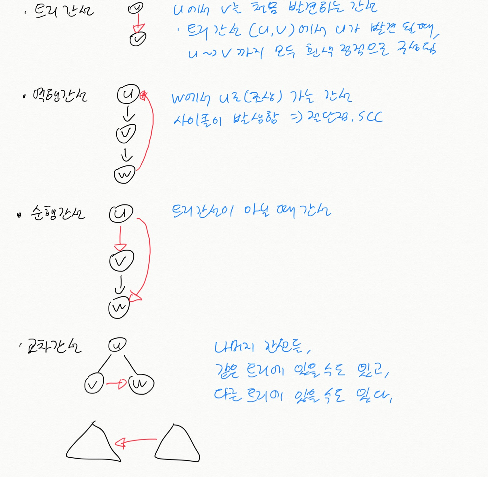

# DFS (Depth-First Search)
  
## 깊이 우선 탐색 
BFS와 다르게 깊이 먼저 탐색하는 방법.  

## 정점 구분
White | Gray | Black |
------|------|-------|
탐색x | 발견시 | 탐색끝

## 특징
1. 시간 기록  
- 그래프 구조에 대한 중요한 정보로 활용 가능.  
- 괄호 구조를 가짐 (발견시간 d[u], 종료시간 f[u])  

### 괄호 정리
시간 정보로 그래프 구조 파악  

설명

### 흰색 경로 정리  
정점 u가 발견될 때, u~>v 까지 모든 경로의 정점들은 흰색 정점으로 구성된다.  
정점 u가 정점 v보다 발견시간이 빠를 경우 (d[u] < d[v]),  
정점v는 정점u의 자손이고, d[u] < (경로 모두 흰색) < d[v] 이다.  
  
ex) u->w->v 로 구성되면 w, v정점은 흰색.  

2. 4가지 종류의 간선이 있음.  
- 트리 간선 : 일반적으로 DFS가 탐색하는 간선, 새로운 정점을 탐색했을 때 간선,  
- 역행 간선 : 조상으로 가는 간선, 사이클(절단점,SCC에 활용 가능)에 해당하는 간선,  
- 순행 간선 : 자손으로 가는 간선 (트리 간선이 아닐 경우),  
- 교차 간선 : 다른 정점으로 cross 하는 나머지 간선들, 간선이 같은 트리에 있을 수도 있고, 다른 트리에 있을 수도 있다.  

설명

  

3. 무방향 그래프에서는 트리, 역행간선만 존재 (순행, 교차간선은 없음)
- 방향이 없기 때문에 순행 간선은 역행 간선이 된다. (u->v->w->u 의 경우 w->u는 역행 간선)  
- 교차 간선은 u->v에서 정점v가 방문 했다면 역행간선이 되고, 방문하지 않았다면 트리간선이 된다.  

## DFS 코드

## 선행 부분 그래프
깊이 우선 트리의 집합인 깊이 우선 포레스트 형성.  

