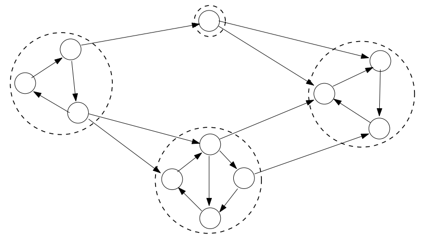

# SCC (Strongly Connected Components)

## 정의
어떤 정점에서 시작해도 서로 도달할 수 있는 컴포넌트.  
u~>v 경로가 있고, v~>u 경로가 있는 컴포넌트.  

## 시간복잡도
O(n+m)

## 특징
1. SCC는 DAG로 구성된다.  
- 사이클이 있다면, 그 사이클이 형성된 부분은 묶여서 SCC가 된다. (SCC정의로 서로 도달 가능하기 때문)  

## 코사라주(Kosaraju) 알고리즘
### 동작 순서
1. 그래프 G의 간선 방향을 reverse한 G_rev 그래프를 만든다.  
2. G_rev를 DFS 이용하여 finishing time 𝑓(u)를 구한다.  
3. 𝑓(u) 내림차순 순서로 G를 DFS 수행한다.  
4. SCC 각 node들은 같은 leader를 가진다.  

### 코드

### Lemma  
finiching time의 내림차순으로 DFS 수행해야 SCC를 구할 수 있는 이유.  
- SCC는 DAG를 이루기 때문에, DAG에 끝에 있는 정점부터 수행해야 SCC를 구할 수 있음.  
  - SCC는 사이클이기 때문에 DAG 끝에 있는 SCC node는 다른 SCC node로 나갈 수 없음.  
  - DAG 중간에 있는 node부터 하면 SCC 끝에 있는 node로 이동해버림.  